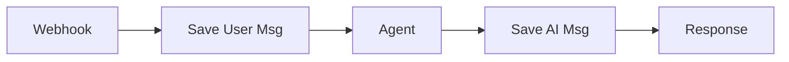
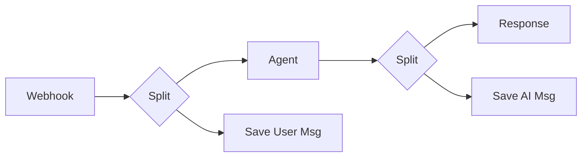
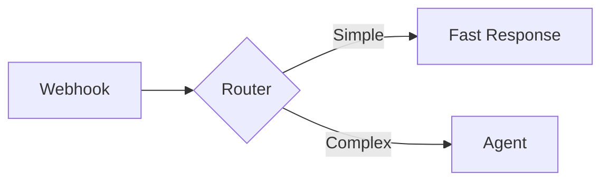

# Phase 02 Context: Response Speed Optimization

## Current State Analysis
**Goal:** Reduce chat response time from 10-20s to 3-5s.
**Workflow:** `Web API Router` (ID: `o5t83JWF11dsSfyi`)

### Critical Bottlenecks Identified
1.  **Blocking "Save AI Msg":**
    *   **Current Flow:** `Agent` → `Clean Response` → `Save AI Msg` (DB Write) → `Respond to Webhook`.
    *   **Impact:** User waits for the database write *after* the AI has already finished thinking.
    *   **Fix:** Parallelize `Save AI Msg` and `Respond to Webhook`.

2.  **Blocking "Save User Msg":**
    *   **Current Flow:** `Webhook` → ... → `Save User Msg` (DB Write) → `Agent`.
    *   **Impact:** Agent cannot start thinking until the user's message is saved to Supabase.
    *   **Fix:** Fork execution flow to save message in parallel with triggering the Agent.

3.  **No Pre-Classification:**
    *   **Current Flow:** All inputs (even "Hi") go to the `Jarvis Brain` (Agent).
    *   **Impact:** Expensive/slow LLM call for trivial queries.
    *   **Fix:** Add a `Switch` node or lightweight Router before the Agent.

4.  **Context Window Size:**
    *   **Current:** `Simple Memory` buffer window is likely set to default or high.
    *   **Impact:** Large context = more tokens = slower processing.
    *   **Fix:** Reduce `contextWindowLength` to 5-6 turns.

## Architecture Plan

### 1. Parallelize I/O (Async Pattern)
Move all Supabase Write operations off the "Critical Path" (the path from Webhook to Response).

**Before:**

**After:**

### 2. Pre-Classification (Fast Path)
Insert a router to bypass the Agent for simple intents.

**Pattern:**

## Risks
- **Race Conditions:** If `Save User Msg` is async, the Agent might try to read the message history before the current message is committed.
    - *Mitigation:* Ensure Agent uses the *input* text directly, not a DB fetch of the current message.
- **Error Handling:** Async errors (DB fail) won't block the response, which is good, but we need to ensure they are logged.

## Technical Requirements
- Modify `Web API Router` workflow.
- No new credentials required.
- No new external services.
